# Work in progress
General description of the examples

### Title of example one
Description of example one

#### The commandline
`dry-gen mermaid-class-diagram-from-csharp --input-file src/develop/DryGen.Docs/bin/Release/net6.0/DryGen.MermaidFromCSharp.dll --output-file docs/examples/Mermaid-Class-diagrams.md --replace-token-in-output-file .!.!.replace-token-for-class-diagram-one.!.!.`
#### The generated Mermaid code
```
classDiagram
	class AllChildFiltersTypeFilter {
		+Accepts(Type type) bool
	}
	class AnyChildFiltersTypeFilter {
		+Accepts(Type type) bool
	}
	class ClassDiagramAttribute {
		+string AttributeType
		+string AttributeName
		+string Visibility
		+bool IsStatic
	}
	class ClassDiagramAttributeLevel {
		<<enumeration>>
		All
		Public
		Internal
		Protected
		None
	}
	class ClassDiagramClass {
		+AddAttribute(ClassDiagramAttribute attribute)
		+AddMethod(ClassDiagramMethod method)
		+AddRelationship(ClassDiagramRelationshipCardinality fromCardinality, ClassDiagramRelationshipType relationshipType, ClassDiagramRelationshipCardinality toCardinality, ClassDiagramClass to, string label, string propertyName)
		+RemoveBidirectionalRelationshipDuplicates()
		#IsRelatedTo(IDiagramType type) bool
		-SwitchFromComposisionToAggregationForAllBidirectionalCollectionReferences(ClassDiagramRelationshipCardinality toCardinality, ClassDiagramClass to, string label)
		-HasBidirectionalRelationship(ClassDiagramClass to) bool
		-SwitchFroComposisionToAggregationIfThisIsABidirectionalCollectionReferences(ClassDiagramRelationshipCardinality& fromCardinality, ClassDiagramRelationshipType& relationshipType, ClassDiagramClass to, String& label, Boolean& isBidirectional)
		-RemoveAnyDependenciesCreatedFromContrutorParameters(ClassDiagramClass to)
		-IsDuplicateDependency(ClassDiagramClass to) bool
		-FindNonBidirectionalAssociationToThisThatMatchesThisAssociation(ClassDiagramClass to) ClassDiagramRelationship
	}
	class ClassDiagramDirection {
		<<enumeration>>
		Default
		BT
		TB
		LR
		RL
	}
	class ClassDiagramExtensions {
		<<abstract>>
		+GetRelationshipPattern(ClassDiagramRelationship relationship)$ string
		+GetCardinalityValue(ClassDiagramRelationshipCardinality cardinality)$ string
		+GetRelationshipLine(ClassDiagramRelationshipType relationship)$ string
		+GetRelationshipStartArrow(ClassDiagramRelationshipType relationship, bool isBidirectional)$ string
		+GetRelationshipEndArrow(ClassDiagramRelationshipType relationship)$ string
		+GetAssociationToCardinality(PropertyInfo property, bool isNullable)$ ClassDiagramRelationshipCardinality
		+GetRelationshipLabel(ClassDiagramRelationship relationship)$ string
	}
	class ClassDiagramGenerator {
		+Generate(Assembly assembly, IReadOnlyList~ITypeFilter~ typeFilters, IReadOnlyList~IPropertyFilter~ attributeFilters, INameRewriter nameRewriter, IDiagramFilter diagramFilter) string
		-GenerateClassDiagramStructure(IEnumerable~ClassDiagramClass~ classes, IReadOnlyList~IPropertyFilter~ attributeFilters)
		-GenerateClassAssociationsCompositionsAndAggregations(IDictionary~Type,ClassDiagramClass~ classLookup, ClassDiagramClass classDiagramClass)$
		-GetPropertyTypeRelationshipInfo(IDictionary~Type,ClassDiagramClass~ classLookup, Type propertyType)$ ValueTuple~bool,bool,bool,Type~
		-IsCollectionOfKnownType(IDictionary~Type,ClassDiagramClass~ classLookup, Type type)$ bool
		-GenerateClassInheritanceOrRealizationForInterfaces(IDictionary~Type,ClassDiagramClass~ classLookup, ClassDiagramClass classDiagramClass)$
		-GenerateClassInheritanceForBaseType(IDictionary~Type,ClassDiagramClass~ classLookup, ClassDiagramClass classDiagramClass)$
		-GetNonClosedGenericBaseType(Type baseType, IDictionary~Type,ClassDiagramClass~ classLookup)$ Type
		-GenerateClassDependencies(IDictionary~Type,ClassDiagramClass~ classLookup, ClassDiagramClass classDiagramClass)$
		-AddDependency(IDictionary~Type,ClassDiagramClass~ classLookup, ClassDiagramClass classDiagramClass, Type parameterType)$
		-GenerateClassAttributes(IDictionary~Type,ClassDiagramClass~ classLookup, ClassDiagramClass classDiagramClass, IReadOnlyList~IPropertyFilter~ attributeFilters)
		-GenerateClassMethods(ClassDiagramClass classDiagramClass)
		-IsMethodWithToLowVisibility(MethodInfo method) bool
		-IsSyntheticCompilerGeneratedMethod(MethodInfo method)$ bool
		-GenerateClassDiagramMermaid(IEnumerable~ClassDiagramClass~ classes, INameRewriter nameRewriter) string
		-AppendDirection(StringBuilder sb)
		-AppendClasses(IEnumerable~ClassDiagramClass~ classes, INameRewriter nameRewriter, StringBuilder sb)
		-AppendEnumerationToClass(StringBuilder sb, ClassDiagramClass classDiagramClass)
		-AppendAttributesToClass(StringBuilder sb, ClassDiagramClass classDiagramClass)$
		-AppendMethodsToClass(StringBuilder sb, ClassDiagramClass classDiagramClass)
		-AppendParamsToClassMethod(StringBuilder sb, ClassDiagramMethod method)$
		-AppedParamsSummaryToClassMethod(StringBuilder sb, ClassDiagramMethod method)$
		-AppendRelationships(IEnumerable~ClassDiagramClass~ classes, INameRewriter nameRewriter, StringBuilder sb)$
		-IsNotGetterOrSetterOrLocalFunction(MethodInfo method)$ bool
		-ClassDiagramFilters(IReadOnlyList~ITypeFilter~ filters) IReadOnlyList~ITypeFilter~
		-IsAttributePropertyType(IDictionary~Type,ClassDiagramClass~ classLookup, PropertyInfo property)$ bool
		-IsAttributePropertyType(IDictionary~Type,ClassDiagramClass~ classLookup, Type propertyType)$ bool
		-GetDataType(Type type, INameRewriter nameRewriter, string genericStartBracket, string genericEndBracket)$ string
		-GetTypeName(string typeName)$ string
		-GetDataTypeForGenericType(Type type, string genericStartBracket, string genericEndBracket)$ string
		-GetVisibility(MethodInfo methodInfo)$ string
	}
	class ClassDiagramMethod {
		+string ReturnType
		+string MethodName
		+string Visibility
		+bool IsStatic
		+bool IsAbstract
	}
	class ClassDiagramMethodLevel {
		<<enumeration>>
		All
		Public
		Internal
		Protected
		None
	}
	class ClassDiagramMethodParameter {
		+string ParameterType
		+string ParameterName
	}
	class ClassDiagramRelationship {
		+string Label
		+string PropertyName
		+bool IsBidirectional
	}
	class ClassDiagramRelationshipCardinality {
		<<enumeration>>
		Unspecified
		ZeroOrOne
		ExactlyOne
		ZeroOrMore
		OneOrMore
	}
	class ClassDiagramRelationshipType {
		<<enumeration>>
		Realization
		Inheritance
		Association
		Composition
		Aggregation
		Dependency
	}
	class ErDiagramAttribute {
		+string AttributeType
		+string AttributeName
		+bool IsNullable
		+bool IsPrimaryKey
		+bool IsAlternateKey
		+bool IsForeignKey
	}
	class ErDiagramAttributeDetailExclusions {
		<<enumeration>>
		None
		KeyTypes
		Comments
		KeyTypesAndComments
	}
	class ErDiagramAttributeTypeExclusion {
		<<enumeration>>
		None
		Foreignkeys
		All
	}
	class ErDiagramEntity {
		+GetAttributes() IReadOnlyList~ErDiagramAttribute~
		+GetRelationships() IReadOnlyList~ErDiagramRelationship~
		+AddAttribute(ErDiagramAttribute attribute)
		+AddRelationship(ErDiagramEntity to, ErDiagramRelationshipCardinality fromCardinality, ErDiagramRelationshipCardinality toCardinality, string label, string propertyName, bool isIdentifying)
		+RemoveBidirectionalRelationshipDuplicates()
		#IsRelatedTo(IDiagramType type) bool
	}
	class ErDiagramExtensions {
		<<abstract>>
		+IsErDiagramRelationshipCollection(Type type)$ bool
		+IsErDiagramAttributePropertyType(PropertyInfo property)$ bool
		+IsErDiagramAttributePropertyType(Type propertyType)$ bool
		+GetErDiagramAttributeTypeName(PropertyInfo property)$ string
		+GetErDiagramAttributeTypeName(Type type)$ string
		+GetFromCardinalityValue(ErDiagramRelationshipCardinality cardinality)$ string
		+GetToCardinalityValue(ErDiagramRelationshipCardinality cardinality)$ string
		+GetRelationshipLine(ErDiagramRelationship relationship)$ string
		+IsMany(ErDiagramRelationshipCardinality cardinality)$ bool
		+IsNotMany(ErDiagramRelationshipCardinality cardinality)$ bool
	}
	class ErDiagramGenerator {
		+Generate(Assembly assembly, IReadOnlyList~ITypeFilter~ typeFilters, IReadOnlyList~IPropertyFilter~ attributeFilters, INameRewriter nameRewriter, IDiagramFilter diagramFilter) string
		-GenerateErDiagramMermaid(IEnumerable~ErDiagramEntity~ entities) string
		-AppendRelationshipsToDiagram(IEnumerable~ErDiagramEntity~ entities, StringBuilder sb)$
		-AppendEntitiesToDiagram(IEnumerable~ErDiagramEntity~ entities, StringBuilder sb)
		-AppendAttributeToEnitity(StringBuilder sb, ErDiagramEntity entity)
		-AppendKeyTypeToAttribute(StringBuilder sb, ErDiagramAttribute attribute)
		-AppendCommentsToAttribute(StringBuilder sb, ErDiagramAttribute attribute)
		-ErDiagramFilters(IReadOnlyList~ITypeFilter~ filters) IReadOnlyList~ITypeFilter~
	}
	class ErDiagramRelationship {
		+string Label
		~string PropertyName
		+bool IsIdenifying
	}
	class ErDiagramRelationshipCardinality {
		<<enumeration>>
		ZeroOrOne
		ExactlyOne
		ZeroOrMore
		OneOrMore
	}
	class ErDiagramRelationshipTypeExclusion {
		<<enumeration>>
		None
		All
	}
	class ErDiagramStructureBuilderByReflection {
		+GenerateErStructure(Assembly assembly, IReadOnlyList~ITypeFilter~ typeFilters, IReadOnlyList~IPropertyFilter~ attributeFilters, INameRewriter nameRewriter) IReadOnlyList~ErDiagramEntity~
		-GeneratieErStructure(IReadOnlyList~ErDiagramEntity~ entities, IReadOnlyList~IPropertyFilter~ attributeFilters)
	}
	class ExcludeAbstractClassTypeFilter {
		+Accepts(Type type) bool
	}
	class ExcludeClosedGenericTypeTypeFilter {
		+Accepts(Type type) bool
	}
	class ExcludeEnumTypeFilter {
		+Accepts(Type type) bool
	}
	class ExcludeNonPublicClassTypeFilter {
		+Accepts(Type type) bool
	}
	class ExcludePropertyNamePropertyFilter {
		+Accepts(PropertyInfo property) bool
	}
	class ExcludeSystemEnumTypeFilter {
		+Accepts(Type type) bool
	}
	class ExcludeSystemObjectAndSystemEnumTypeFilter {
	}
	class ExcludeSystemObjectTypeFilter {
		+Accepts(Type type) bool
	}
	class ExcludeTypeNameTypeFilter {
		+Accepts(Type type) bool
	}
	class Extensions {
		<<abstract>>
		+GetDirectInterfaces(Type type)$ IEnumerable~Type~
		+GetRelationshipLabel(string propertyName, string entityName, bool replaceEntityNameAtEndOfPropertyName)$ string
	}
	class IClassDiagramGenerator {
		<<interface>>
	}
	class IDiagramFilter {
		<<interface>>
		+Filter(IEnumerable~IDiagramType~ types)* IEnumerable~IDiagramType~
	}
	class IDiagramGenerator {
		<<interface>>
		+Generate(Assembly assembly, IReadOnlyList~ITypeFilter~ typeFilters, IReadOnlyList~IPropertyFilter~ attributeFilters, INameRewriter nameRewriter, IDiagramFilter diagramFilter)* string
	}
	class IDiagramType {
		<<interface>>
		+string Name
		+Type Type
		+IsRelatedToAny(IEnumerable~IDiagramType~ types)* bool
	}
	class IErDiagramGenerator {
		<<interface>>
	}
	class IErDiagramStructureBuilder {
		<<interface>>
		+GenerateErStructure(Assembly assembly, IReadOnlyList~ITypeFilter~ typeFilters, IReadOnlyList~IPropertyFilter~ attributeFilters, INameRewriter nameRewriter)* IReadOnlyList~ErDiagramEntity~
	}
	class IMermaidClassDiagramFromCSharpOptions {
		<<interface>>
		+bool ExcludeStaticAttributes
		+bool ExcludeStaticMethods
		+bool ExcludeMethodParams
	}
	class IMermaidDiagramOptions {
		<<interface>>
		+IEnumerable~string~ IncludeNamespaces
		+IEnumerable~string~ IncludeTypeNames
		+IEnumerable~string~ ExcludeTypeNames
		+IEnumerable~string~ ExcludePropertyNames
		+string NameReplaceFrom
		+string NameReplaceTo
	}
	class IMermaidErDiagramFromCSharpOptions {
		<<interface>>
	}
	class INameRewriter {
		<<interface>>
		+Rewrite(string name)* string
	}
	class IncludeNamespaceTypeFilter {
		+Accepts(Type type) bool
	}
	class IncludeTypeNameTypeFilter {
		+Accepts(Type type) bool
	}
	class IPropertyFilter {
		<<interface>>
		+Accepts(PropertyInfo property)* bool
	}
	class ITypeFilter {
		<<interface>>
		+Accepts(Type type)* bool
	}
	class ITypeLoader {
		<<interface>>
		+Load(Assembly assembly, IReadOnlyList~ITypeFilter~ typeFilters, INameRewriter nameRewriter)* IReadOnlyList~NamedType~
	}
	class NamedType {
		+string Name
		+Type Type
		+IsRelatedToAny(IEnumerable~IDiagramType~ types) bool
		#IsRelatedTo(IDiagramType type) bool
	}
	class ReplaceNameRewriter {
		+Rewrite(string name) string
	}
	class TreeShakingDiagramFilter {
		+Filter(IEnumerable~IDiagramType~ types) IEnumerable~IDiagramType~
		-GetNonRootedTypes(IEnumerable~IDiagramType~ allTypes, IEnumerable~IDiagramType~ rootedTypes) IEnumerable~IDiagramType~
	}
	class TypeLoaderByReflection {
		+Load(Assembly assembly, IReadOnlyList~ITypeFilter~ typeFilters, INameRewriter nameRewriter) IReadOnlyList~NamedType~
	}
	AllChildFiltersTypeFilter ..|> ITypeFilter
	AnyChildFiltersTypeFilter ..|> ITypeFilter
	ClassDiagramClass --|> NamedType
	ClassDiagramClass *-- "*" ClassDiagramAttribute : attributes
	ClassDiagramClass *-- "*" ClassDiagramMethod : methods
	ClassDiagramClass "0..1" o-- "*" ClassDiagramRelationship : relationships
	ClassDiagramGenerator ..> ITypeLoader
	ClassDiagramGenerator ..> IMermaidClassDiagramFromCSharpOptions
	ClassDiagramGenerator ..|> IClassDiagramGenerator
	ClassDiagramMethod *-- "*" ClassDiagramMethodParameter : parameters
	ClassDiagramRelationship --> "0..1" ClassDiagramRelationshipCardinality : from cardinality
	ClassDiagramRelationship --> "0..1" ClassDiagramRelationshipType : relationsship type
	ClassDiagramRelationship --> "0..1" ClassDiagramRelationshipCardinality : to cardinality
	ErDiagramEntity --|> NamedType
	ErDiagramEntity "0..1" o-- "*" ErDiagramRelationship : relationships
	ErDiagramGenerator ..> IMermaidErDiagramFromCSharpOptions
	ErDiagramGenerator ..> IErDiagramStructureBuilder
	ErDiagramGenerator ..> ErDiagramAttributeTypeExclusion
	ErDiagramGenerator ..> ErDiagramAttributeDetailExclusions
	ErDiagramGenerator ..> ErDiagramRelationshipTypeExclusion
	ErDiagramGenerator ..|> IErDiagramGenerator
	ErDiagramRelationship --> "0..1" ErDiagramRelationshipCardinality : from cardinality
	ErDiagramRelationship --> "0..1" ErDiagramRelationshipCardinality : to cardinality
	ErDiagramStructureBuilderByReflection ..|> IErDiagramStructureBuilder
	ErDiagramStructureBuilderByReflection --|> TypeLoaderByReflection
	ExcludeAbstractClassTypeFilter ..|> ITypeFilter
	ExcludeClosedGenericTypeTypeFilter ..|> ITypeFilter
	ExcludeEnumTypeFilter ..|> ITypeFilter
	ExcludeNonPublicClassTypeFilter ..|> ITypeFilter
	ExcludePropertyNamePropertyFilter ..|> IPropertyFilter
	ExcludeSystemEnumTypeFilter ..|> ITypeFilter
	ExcludeSystemObjectAndSystemEnumTypeFilter --|> AllChildFiltersTypeFilter
	ExcludeSystemObjectTypeFilter ..|> ITypeFilter
	ExcludeTypeNameTypeFilter ..|> ITypeFilter
	IClassDiagramGenerator --|> IDiagramGenerator
	IErDiagramGenerator --|> IDiagramGenerator
	IMermaidClassDiagramFromCSharpOptions --> "0..1" ClassDiagramAttributeLevel : attribute level
	IMermaidClassDiagramFromCSharpOptions --> "0..1" ClassDiagramMethodLevel : method level
	IMermaidClassDiagramFromCSharpOptions --> "0..1" ClassDiagramDirection : direction
	IMermaidClassDiagramFromCSharpOptions --|> IMermaidDiagramOptions
	IMermaidErDiagramFromCSharpOptions --> "0..1" ErDiagramAttributeTypeExclusion : attribute type exclusion
	IMermaidErDiagramFromCSharpOptions --> "0..1" ErDiagramAttributeDetailExclusions : attribute detail exclusions
	IMermaidErDiagramFromCSharpOptions --> "0..1" ErDiagramRelationshipTypeExclusion : relationship type exclusion
	IMermaidErDiagramFromCSharpOptions --> "0..1" IErDiagramStructureBuilder : structure builder
	IMermaidErDiagramFromCSharpOptions --|> IMermaidDiagramOptions
	IncludeNamespaceTypeFilter ..|> ITypeFilter
	IncludeTypeNameTypeFilter ..|> ITypeFilter
	NamedType ..|> IDiagramType
	ReplaceNameRewriter ..|> INameRewriter
	TreeShakingDiagramFilter ..> ITypeFilter
	TreeShakingDiagramFilter ..|> IDiagramFilter
	TypeLoaderByReflection ..|> ITypeLoader

```
#### The resulting Mermaid diagram
If  you are using a markdown reader/editor that can render inline Mermaid diagrams, you should see the resulting Mermaid Class diagram below, otherwise you will only see the same Mermaid code as above

```mermaid
classDiagram
	class AllChildFiltersTypeFilter {
		+Accepts(Type type) bool
	}
	class AnyChildFiltersTypeFilter {
		+Accepts(Type type) bool
	}
	class ClassDiagramAttribute {
		+string AttributeType
		+string AttributeName
		+string Visibility
		+bool IsStatic
	}
	class ClassDiagramAttributeLevel {
		<<enumeration>>
		All
		Public
		Internal
		Protected
		None
	}
	class ClassDiagramClass {
		+AddAttribute(ClassDiagramAttribute attribute)
		+AddMethod(ClassDiagramMethod method)
		+AddRelationship(ClassDiagramRelationshipCardinality fromCardinality, ClassDiagramRelationshipType relationshipType, ClassDiagramRelationshipCardinality toCardinality, ClassDiagramClass to, string label, string propertyName)
		+RemoveBidirectionalRelationshipDuplicates()
		#IsRelatedTo(IDiagramType type) bool
		-SwitchFromComposisionToAggregationForAllBidirectionalCollectionReferences(ClassDiagramRelationshipCardinality toCardinality, ClassDiagramClass to, string label)
		-HasBidirectionalRelationship(ClassDiagramClass to) bool
		-SwitchFroComposisionToAggregationIfThisIsABidirectionalCollectionReferences(ClassDiagramRelationshipCardinality& fromCardinality, ClassDiagramRelationshipType& relationshipType, ClassDiagramClass to, String& label, Boolean& isBidirectional)
		-RemoveAnyDependenciesCreatedFromContrutorParameters(ClassDiagramClass to)
		-IsDuplicateDependency(ClassDiagramClass to) bool
		-FindNonBidirectionalAssociationToThisThatMatchesThisAssociation(ClassDiagramClass to) ClassDiagramRelationship
	}
	class ClassDiagramDirection {
		<<enumeration>>
		Default
		BT
		TB
		LR
		RL
	}
	class ClassDiagramExtensions {
		<<abstract>>
		+GetRelationshipPattern(ClassDiagramRelationship relationship)$ string
		+GetCardinalityValue(ClassDiagramRelationshipCardinality cardinality)$ string
		+GetRelationshipLine(ClassDiagramRelationshipType relationship)$ string
		+GetRelationshipStartArrow(ClassDiagramRelationshipType relationship, bool isBidirectional)$ string
		+GetRelationshipEndArrow(ClassDiagramRelationshipType relationship)$ string
		+GetAssociationToCardinality(PropertyInfo property, bool isNullable)$ ClassDiagramRelationshipCardinality
		+GetRelationshipLabel(ClassDiagramRelationship relationship)$ string
	}
	class ClassDiagramGenerator {
		+Generate(Assembly assembly, IReadOnlyList~ITypeFilter~ typeFilters, IReadOnlyList~IPropertyFilter~ attributeFilters, INameRewriter nameRewriter, IDiagramFilter diagramFilter) string
		-GenerateClassDiagramStructure(IEnumerable~ClassDiagramClass~ classes, IReadOnlyList~IPropertyFilter~ attributeFilters)
		-GenerateClassAssociationsCompositionsAndAggregations(IDictionary~Type,ClassDiagramClass~ classLookup, ClassDiagramClass classDiagramClass)$
		-GetPropertyTypeRelationshipInfo(IDictionary~Type,ClassDiagramClass~ classLookup, Type propertyType)$ ValueTuple~bool,bool,bool,Type~
		-IsCollectionOfKnownType(IDictionary~Type,ClassDiagramClass~ classLookup, Type type)$ bool
		-GenerateClassInheritanceOrRealizationForInterfaces(IDictionary~Type,ClassDiagramClass~ classLookup, ClassDiagramClass classDiagramClass)$
		-GenerateClassInheritanceForBaseType(IDictionary~Type,ClassDiagramClass~ classLookup, ClassDiagramClass classDiagramClass)$
		-GetNonClosedGenericBaseType(Type baseType, IDictionary~Type,ClassDiagramClass~ classLookup)$ Type
		-GenerateClassDependencies(IDictionary~Type,ClassDiagramClass~ classLookup, ClassDiagramClass classDiagramClass)$
		-AddDependency(IDictionary~Type,ClassDiagramClass~ classLookup, ClassDiagramClass classDiagramClass, Type parameterType)$
		-GenerateClassAttributes(IDictionary~Type,ClassDiagramClass~ classLookup, ClassDiagramClass classDiagramClass, IReadOnlyList~IPropertyFilter~ attributeFilters)
		-GenerateClassMethods(ClassDiagramClass classDiagramClass)
		-IsMethodWithToLowVisibility(MethodInfo method) bool
		-IsSyntheticCompilerGeneratedMethod(MethodInfo method)$ bool
		-GenerateClassDiagramMermaid(IEnumerable~ClassDiagramClass~ classes, INameRewriter nameRewriter) string
		-AppendDirection(StringBuilder sb)
		-AppendClasses(IEnumerable~ClassDiagramClass~ classes, INameRewriter nameRewriter, StringBuilder sb)
		-AppendEnumerationToClass(StringBuilder sb, ClassDiagramClass classDiagramClass)
		-AppendAttributesToClass(StringBuilder sb, ClassDiagramClass classDiagramClass)$
		-AppendMethodsToClass(StringBuilder sb, ClassDiagramClass classDiagramClass)
		-AppendParamsToClassMethod(StringBuilder sb, ClassDiagramMethod method)$
		-AppedParamsSummaryToClassMethod(StringBuilder sb, ClassDiagramMethod method)$
		-AppendRelationships(IEnumerable~ClassDiagramClass~ classes, INameRewriter nameRewriter, StringBuilder sb)$
		-IsNotGetterOrSetterOrLocalFunction(MethodInfo method)$ bool
		-ClassDiagramFilters(IReadOnlyList~ITypeFilter~ filters) IReadOnlyList~ITypeFilter~
		-IsAttributePropertyType(IDictionary~Type,ClassDiagramClass~ classLookup, PropertyInfo property)$ bool
		-IsAttributePropertyType(IDictionary~Type,ClassDiagramClass~ classLookup, Type propertyType)$ bool
		-GetDataType(Type type, INameRewriter nameRewriter, string genericStartBracket, string genericEndBracket)$ string
		-GetTypeName(string typeName)$ string
		-GetDataTypeForGenericType(Type type, string genericStartBracket, string genericEndBracket)$ string
		-GetVisibility(MethodInfo methodInfo)$ string
	}
	class ClassDiagramMethod {
		+string ReturnType
		+string MethodName
		+string Visibility
		+bool IsStatic
		+bool IsAbstract
	}
	class ClassDiagramMethodLevel {
		<<enumeration>>
		All
		Public
		Internal
		Protected
		None
	}
	class ClassDiagramMethodParameter {
		+string ParameterType
		+string ParameterName
	}
	class ClassDiagramRelationship {
		+string Label
		+string PropertyName
		+bool IsBidirectional
	}
	class ClassDiagramRelationshipCardinality {
		<<enumeration>>
		Unspecified
		ZeroOrOne
		ExactlyOne
		ZeroOrMore
		OneOrMore
	}
	class ClassDiagramRelationshipType {
		<<enumeration>>
		Realization
		Inheritance
		Association
		Composition
		Aggregation
		Dependency
	}
	class ErDiagramAttribute {
		+string AttributeType
		+string AttributeName
		+bool IsNullable
		+bool IsPrimaryKey
		+bool IsAlternateKey
		+bool IsForeignKey
	}
	class ErDiagramAttributeDetailExclusions {
		<<enumeration>>
		None
		KeyTypes
		Comments
		KeyTypesAndComments
	}
	class ErDiagramAttributeTypeExclusion {
		<<enumeration>>
		None
		Foreignkeys
		All
	}
	class ErDiagramEntity {
		+GetAttributes() IReadOnlyList~ErDiagramAttribute~
		+GetRelationships() IReadOnlyList~ErDiagramRelationship~
		+AddAttribute(ErDiagramAttribute attribute)
		+AddRelationship(ErDiagramEntity to, ErDiagramRelationshipCardinality fromCardinality, ErDiagramRelationshipCardinality toCardinality, string label, string propertyName, bool isIdentifying)
		+RemoveBidirectionalRelationshipDuplicates()
		#IsRelatedTo(IDiagramType type) bool
	}
	class ErDiagramExtensions {
		<<abstract>>
		+IsErDiagramRelationshipCollection(Type type)$ bool
		+IsErDiagramAttributePropertyType(PropertyInfo property)$ bool
		+IsErDiagramAttributePropertyType(Type propertyType)$ bool
		+GetErDiagramAttributeTypeName(PropertyInfo property)$ string
		+GetErDiagramAttributeTypeName(Type type)$ string
		+GetFromCardinalityValue(ErDiagramRelationshipCardinality cardinality)$ string
		+GetToCardinalityValue(ErDiagramRelationshipCardinality cardinality)$ string
		+GetRelationshipLine(ErDiagramRelationship relationship)$ string
		+IsMany(ErDiagramRelationshipCardinality cardinality)$ bool
		+IsNotMany(ErDiagramRelationshipCardinality cardinality)$ bool
	}
	class ErDiagramGenerator {
		+Generate(Assembly assembly, IReadOnlyList~ITypeFilter~ typeFilters, IReadOnlyList~IPropertyFilter~ attributeFilters, INameRewriter nameRewriter, IDiagramFilter diagramFilter) string
		-GenerateErDiagramMermaid(IEnumerable~ErDiagramEntity~ entities) string
		-AppendRelationshipsToDiagram(IEnumerable~ErDiagramEntity~ entities, StringBuilder sb)$
		-AppendEntitiesToDiagram(IEnumerable~ErDiagramEntity~ entities, StringBuilder sb)
		-AppendAttributeToEnitity(StringBuilder sb, ErDiagramEntity entity)
		-AppendKeyTypeToAttribute(StringBuilder sb, ErDiagramAttribute attribute)
		-AppendCommentsToAttribute(StringBuilder sb, ErDiagramAttribute attribute)
		-ErDiagramFilters(IReadOnlyList~ITypeFilter~ filters) IReadOnlyList~ITypeFilter~
	}
	class ErDiagramRelationship {
		+string Label
		~string PropertyName
		+bool IsIdenifying
	}
	class ErDiagramRelationshipCardinality {
		<<enumeration>>
		ZeroOrOne
		ExactlyOne
		ZeroOrMore
		OneOrMore
	}
	class ErDiagramRelationshipTypeExclusion {
		<<enumeration>>
		None
		All
	}
	class ErDiagramStructureBuilderByReflection {
		+GenerateErStructure(Assembly assembly, IReadOnlyList~ITypeFilter~ typeFilters, IReadOnlyList~IPropertyFilter~ attributeFilters, INameRewriter nameRewriter) IReadOnlyList~ErDiagramEntity~
		-GeneratieErStructure(IReadOnlyList~ErDiagramEntity~ entities, IReadOnlyList~IPropertyFilter~ attributeFilters)
	}
	class ExcludeAbstractClassTypeFilter {
		+Accepts(Type type) bool
	}
	class ExcludeClosedGenericTypeTypeFilter {
		+Accepts(Type type) bool
	}
	class ExcludeEnumTypeFilter {
		+Accepts(Type type) bool
	}
	class ExcludeNonPublicClassTypeFilter {
		+Accepts(Type type) bool
	}
	class ExcludePropertyNamePropertyFilter {
		+Accepts(PropertyInfo property) bool
	}
	class ExcludeSystemEnumTypeFilter {
		+Accepts(Type type) bool
	}
	class ExcludeSystemObjectAndSystemEnumTypeFilter {
	}
	class ExcludeSystemObjectTypeFilter {
		+Accepts(Type type) bool
	}
	class ExcludeTypeNameTypeFilter {
		+Accepts(Type type) bool
	}
	class Extensions {
		<<abstract>>
		+GetDirectInterfaces(Type type)$ IEnumerable~Type~
		+GetRelationshipLabel(string propertyName, string entityName, bool replaceEntityNameAtEndOfPropertyName)$ string
	}
	class IClassDiagramGenerator {
		<<interface>>
	}
	class IDiagramFilter {
		<<interface>>
		+Filter(IEnumerable~IDiagramType~ types)* IEnumerable~IDiagramType~
	}
	class IDiagramGenerator {
		<<interface>>
		+Generate(Assembly assembly, IReadOnlyList~ITypeFilter~ typeFilters, IReadOnlyList~IPropertyFilter~ attributeFilters, INameRewriter nameRewriter, IDiagramFilter diagramFilter)* string
	}
	class IDiagramType {
		<<interface>>
		+string Name
		+Type Type
		+IsRelatedToAny(IEnumerable~IDiagramType~ types)* bool
	}
	class IErDiagramGenerator {
		<<interface>>
	}
	class IErDiagramStructureBuilder {
		<<interface>>
		+GenerateErStructure(Assembly assembly, IReadOnlyList~ITypeFilter~ typeFilters, IReadOnlyList~IPropertyFilter~ attributeFilters, INameRewriter nameRewriter)* IReadOnlyList~ErDiagramEntity~
	}
	class IMermaidClassDiagramFromCSharpOptions {
		<<interface>>
		+bool ExcludeStaticAttributes
		+bool ExcludeStaticMethods
		+bool ExcludeMethodParams
	}
	class IMermaidDiagramOptions {
		<<interface>>
		+IEnumerable~string~ IncludeNamespaces
		+IEnumerable~string~ IncludeTypeNames
		+IEnumerable~string~ ExcludeTypeNames
		+IEnumerable~string~ ExcludePropertyNames
		+string NameReplaceFrom
		+string NameReplaceTo
	}
	class IMermaidErDiagramFromCSharpOptions {
		<<interface>>
	}
	class INameRewriter {
		<<interface>>
		+Rewrite(string name)* string
	}
	class IncludeNamespaceTypeFilter {
		+Accepts(Type type) bool
	}
	class IncludeTypeNameTypeFilter {
		+Accepts(Type type) bool
	}
	class IPropertyFilter {
		<<interface>>
		+Accepts(PropertyInfo property)* bool
	}
	class ITypeFilter {
		<<interface>>
		+Accepts(Type type)* bool
	}
	class ITypeLoader {
		<<interface>>
		+Load(Assembly assembly, IReadOnlyList~ITypeFilter~ typeFilters, INameRewriter nameRewriter)* IReadOnlyList~NamedType~
	}
	class NamedType {
		+string Name
		+Type Type
		+IsRelatedToAny(IEnumerable~IDiagramType~ types) bool
		#IsRelatedTo(IDiagramType type) bool
	}
	class ReplaceNameRewriter {
		+Rewrite(string name) string
	}
	class TreeShakingDiagramFilter {
		+Filter(IEnumerable~IDiagramType~ types) IEnumerable~IDiagramType~
		-GetNonRootedTypes(IEnumerable~IDiagramType~ allTypes, IEnumerable~IDiagramType~ rootedTypes) IEnumerable~IDiagramType~
	}
	class TypeLoaderByReflection {
		+Load(Assembly assembly, IReadOnlyList~ITypeFilter~ typeFilters, INameRewriter nameRewriter) IReadOnlyList~NamedType~
	}
	AllChildFiltersTypeFilter ..|> ITypeFilter
	AnyChildFiltersTypeFilter ..|> ITypeFilter
	ClassDiagramClass --|> NamedType
	ClassDiagramClass *-- "*" ClassDiagramAttribute : attributes
	ClassDiagramClass *-- "*" ClassDiagramMethod : methods
	ClassDiagramClass "0..1" o-- "*" ClassDiagramRelationship : relationships
	ClassDiagramGenerator ..> ITypeLoader
	ClassDiagramGenerator ..> IMermaidClassDiagramFromCSharpOptions
	ClassDiagramGenerator ..|> IClassDiagramGenerator
	ClassDiagramMethod *-- "*" ClassDiagramMethodParameter : parameters
	ClassDiagramRelationship --> "0..1" ClassDiagramRelationshipCardinality : from cardinality
	ClassDiagramRelationship --> "0..1" ClassDiagramRelationshipType : relationsship type
	ClassDiagramRelationship --> "0..1" ClassDiagramRelationshipCardinality : to cardinality
	ErDiagramEntity --|> NamedType
	ErDiagramEntity "0..1" o-- "*" ErDiagramRelationship : relationships
	ErDiagramGenerator ..> IMermaidErDiagramFromCSharpOptions
	ErDiagramGenerator ..> IErDiagramStructureBuilder
	ErDiagramGenerator ..> ErDiagramAttributeTypeExclusion
	ErDiagramGenerator ..> ErDiagramAttributeDetailExclusions
	ErDiagramGenerator ..> ErDiagramRelationshipTypeExclusion
	ErDiagramGenerator ..|> IErDiagramGenerator
	ErDiagramRelationship --> "0..1" ErDiagramRelationshipCardinality : from cardinality
	ErDiagramRelationship --> "0..1" ErDiagramRelationshipCardinality : to cardinality
	ErDiagramStructureBuilderByReflection ..|> IErDiagramStructureBuilder
	ErDiagramStructureBuilderByReflection --|> TypeLoaderByReflection
	ExcludeAbstractClassTypeFilter ..|> ITypeFilter
	ExcludeClosedGenericTypeTypeFilter ..|> ITypeFilter
	ExcludeEnumTypeFilter ..|> ITypeFilter
	ExcludeNonPublicClassTypeFilter ..|> ITypeFilter
	ExcludePropertyNamePropertyFilter ..|> IPropertyFilter
	ExcludeSystemEnumTypeFilter ..|> ITypeFilter
	ExcludeSystemObjectAndSystemEnumTypeFilter --|> AllChildFiltersTypeFilter
	ExcludeSystemObjectTypeFilter ..|> ITypeFilter
	ExcludeTypeNameTypeFilter ..|> ITypeFilter
	IClassDiagramGenerator --|> IDiagramGenerator
	IErDiagramGenerator --|> IDiagramGenerator
	IMermaidClassDiagramFromCSharpOptions --> "0..1" ClassDiagramAttributeLevel : attribute level
	IMermaidClassDiagramFromCSharpOptions --> "0..1" ClassDiagramMethodLevel : method level
	IMermaidClassDiagramFromCSharpOptions --> "0..1" ClassDiagramDirection : direction
	IMermaidClassDiagramFromCSharpOptions --|> IMermaidDiagramOptions
	IMermaidErDiagramFromCSharpOptions --> "0..1" ErDiagramAttributeTypeExclusion : attribute type exclusion
	IMermaidErDiagramFromCSharpOptions --> "0..1" ErDiagramAttributeDetailExclusions : attribute detail exclusions
	IMermaidErDiagramFromCSharpOptions --> "0..1" ErDiagramRelationshipTypeExclusion : relationship type exclusion
	IMermaidErDiagramFromCSharpOptions --> "0..1" IErDiagramStructureBuilder : structure builder
	IMermaidErDiagramFromCSharpOptions --|> IMermaidDiagramOptions
	IncludeNamespaceTypeFilter ..|> ITypeFilter
	IncludeTypeNameTypeFilter ..|> ITypeFilter
	NamedType ..|> IDiagramType
	ReplaceNameRewriter ..|> INameRewriter
	TreeShakingDiagramFilter ..> ITypeFilter
	TreeShakingDiagramFilter ..|> IDiagramFilter
	TypeLoaderByReflection ..|> ITypeLoader

```

