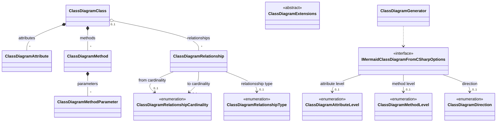

---
# Autogenerated by the Docs build step. Do not edit this file by hand, as your edits will be overwritten by the next Docs build.
# Source file: "docs/_templates/examples/Filtering-Mermaid-diagram-content.md"
layout: page
title: Examples of how to filter Mermaid diagram content
description: Examples of how to filter Mermaid diagram content from C# code
show_sidebar: false
toc: true
hero_height: is-fullwidth
---
### About these examples
These examples show how you can control C# types that will be included in your Mermaid diagrams. Here we will only focus on the Class diagrams, but the filtering capabilities are the same for ER diagrams, so you can use the same filters for your ER diagrams.

In the following examples we exclude most of the diagram content details, to make it easier to follow the examples. [The Mermaid Class diagram details examples](../mermaid-class-diagram-details/) digs into more details on how to control the content details in your Mermaid Class diagrams and [the Mermaid ER diagram details examples](../mermaid-er-diagram-details/) does the same for Mermaid Er diagrams.

### No filtering
Most C# codebases will soon contain a lot of types, so a class diagram without any filters can be far to detailed to be of any practical use.
#### The commandline
`dry-gen mermaid-class-diagram-from-csharp --input-file src/develop/DryGen.Docs/bin/Release/net6.0/DryGen.MermaidFromCSharp.dll --output-file docs/examples/filtering-mermaid-diagram-content.md --replace-token-in-output-file .!.!.replace-token-for-mermaid-diagram-filter-example-no-filtering.!.!. --attribute-level none --method-level none --direction TB`
#### The resulting Mermaid diagram

```mermaid
classDiagram
	direction TB
	class AllChildFiltersTypeFilter {
	}
	class AnyChildFiltersTypeFilter {
	}
	class ClassDiagramAttribute {
	}
	class ClassDiagramAttributeLevel {
		<<enumeration>>
	}
	class ClassDiagramClass {
	}
	class ClassDiagramDirection {
		<<enumeration>>
	}
	class ClassDiagramExtensions {
		<<abstract>>
	}
	class ClassDiagramGenerator {
	}
	class ClassDiagramMethod {
	}
	class ClassDiagramMethodLevel {
		<<enumeration>>
	}
	class ClassDiagramMethodParameter {
	}
	class ClassDiagramRelationship {
	}
	class ClassDiagramRelationshipCardinality {
		<<enumeration>>
	}
	class ClassDiagramRelationshipType {
		<<enumeration>>
	}
	class ErDiagramAttribute {
	}
	class ErDiagramAttributeDetailExclusions {
		<<enumeration>>
	}
	class ErDiagramAttributeTypeExclusion {
		<<enumeration>>
	}
	class ErDiagramEntity {
	}
	class ErDiagramExtensions {
		<<abstract>>
	}
	class ErDiagramGenerator {
	}
	class ErDiagramRelationship {
	}
	class ErDiagramRelationshipCardinality {
		<<enumeration>>
	}
	class ErDiagramRelationshipTypeExclusion {
		<<enumeration>>
	}
	class ErDiagramStructureBuilderByReflection {
	}
	class ExcludeAbstractClassTypeFilter {
	}
	class ExcludeClosedGenericTypeTypeFilter {
	}
	class ExcludeEnumTypeFilter {
	}
	class ExcludeNonPublicClassTypeFilter {
	}
	class ExcludePropertyNamePropertyFilter {
	}
	class ExcludeSystemEnumTypeFilter {
	}
	class ExcludeSystemObjectAndSystemEnumTypeFilter {
	}
	class ExcludeSystemObjectTypeFilter {
	}
	class ExcludeTypeNameTypeFilter {
	}
	class Extensions {
		<<abstract>>
	}
	class IClassDiagramGenerator {
		<<interface>>
	}
	class IDiagramFilter {
		<<interface>>
	}
	class IDiagramGenerator {
		<<interface>>
	}
	class IDiagramType {
		<<interface>>
	}
	class IErDiagramGenerator {
		<<interface>>
	}
	class IErDiagramStructureBuilder {
		<<interface>>
	}
	class IMermaidClassDiagramFromCSharpOptions {
		<<interface>>
	}
	class IMermaidDiagramOptions {
		<<interface>>
	}
	class IMermaidErDiagramFromCSharpOptions {
		<<interface>>
	}
	class INameRewriter {
		<<interface>>
	}
	class IncludeNamespaceTypeFilter {
	}
	class IncludeTypeNameTypeFilter {
	}
	class IPropertyFilter {
		<<interface>>
	}
	class ITypeFilter {
		<<interface>>
	}
	class ITypeLoader {
		<<interface>>
	}
	class NamedType {
	}
	class ReplaceNameRewriter {
	}
	class TreeShakingDiagramFilter {
	}
	class TypeLoaderByReflection {
	}
	AllChildFiltersTypeFilter ..|> ITypeFilter
	AnyChildFiltersTypeFilter ..|> ITypeFilter
	ClassDiagramClass --|> NamedType
	ClassDiagramClass *-- "*" ClassDiagramAttribute : attributes
	ClassDiagramClass *-- "*" ClassDiagramMethod : methods
	ClassDiagramClass "0..1" o-- "*" ClassDiagramRelationship : relationships
	ClassDiagramGenerator ..> ITypeLoader
	ClassDiagramGenerator ..> IMermaidClassDiagramFromCSharpOptions
	ClassDiagramGenerator ..|> IClassDiagramGenerator
	ClassDiagramMethod *-- "*" ClassDiagramMethodParameter : parameters
	ClassDiagramRelationship --> "0..1" ClassDiagramRelationshipCardinality : from cardinality
	ClassDiagramRelationship --> "0..1" ClassDiagramRelationshipType : relationsship type
	ClassDiagramRelationship --> "0..1" ClassDiagramRelationshipCardinality : to cardinality
	ErDiagramEntity --|> NamedType
	ErDiagramEntity "0..1" o-- "*" ErDiagramRelationship : relationships
	ErDiagramGenerator ..> IMermaidErDiagramFromCSharpOptions
	ErDiagramGenerator ..> IErDiagramStructureBuilder
	ErDiagramGenerator ..> ErDiagramAttributeTypeExclusion
	ErDiagramGenerator ..> ErDiagramAttributeDetailExclusions
	ErDiagramGenerator ..> ErDiagramRelationshipTypeExclusion
	ErDiagramGenerator ..|> IErDiagramGenerator
	ErDiagramRelationship --> "0..1" ErDiagramRelationshipCardinality : from cardinality
	ErDiagramRelationship --> "0..1" ErDiagramRelationshipCardinality : to cardinality
	ErDiagramStructureBuilderByReflection ..|> IErDiagramStructureBuilder
	ErDiagramStructureBuilderByReflection --|> TypeLoaderByReflection
	ExcludeAbstractClassTypeFilter ..|> ITypeFilter
	ExcludeClosedGenericTypeTypeFilter ..|> ITypeFilter
	ExcludeEnumTypeFilter ..|> ITypeFilter
	ExcludeNonPublicClassTypeFilter ..|> ITypeFilter
	ExcludePropertyNamePropertyFilter ..|> IPropertyFilter
	ExcludeSystemEnumTypeFilter ..|> ITypeFilter
	ExcludeSystemObjectAndSystemEnumTypeFilter --|> AllChildFiltersTypeFilter
	ExcludeSystemObjectTypeFilter ..|> ITypeFilter
	ExcludeTypeNameTypeFilter ..|> ITypeFilter
	IClassDiagramGenerator --|> IDiagramGenerator
	IErDiagramGenerator --|> IDiagramGenerator
	IMermaidClassDiagramFromCSharpOptions --> "0..1" ClassDiagramAttributeLevel : attribute level
	IMermaidClassDiagramFromCSharpOptions --> "0..1" ClassDiagramMethodLevel : method level
	IMermaidClassDiagramFromCSharpOptions --> "0..1" ClassDiagramDirection : direction
	IMermaidClassDiagramFromCSharpOptions --|> IMermaidDiagramOptions
	IMermaidErDiagramFromCSharpOptions --> "0..1" ErDiagramAttributeTypeExclusion : attribute type exclusion
	IMermaidErDiagramFromCSharpOptions --> "0..1" ErDiagramAttributeDetailExclusions : attribute detail exclusions
	IMermaidErDiagramFromCSharpOptions --> "0..1" ErDiagramRelationshipTypeExclusion : relationship type exclusion
	IMermaidErDiagramFromCSharpOptions --> "0..1" IErDiagramStructureBuilder : structure builder
	IMermaidErDiagramFromCSharpOptions --|> IMermaidDiagramOptions
	IncludeNamespaceTypeFilter ..|> ITypeFilter
	IncludeTypeNameTypeFilter ..|> ITypeFilter
	NamedType ..|> IDiagramType
	ReplaceNameRewriter ..|> INameRewriter
	TreeShakingDiagramFilter ..> ITypeFilter
	TreeShakingDiagramFilter ..|> IDiagramFilter
	TypeLoaderByReflection ..|> ITypeLoader

```

### Filtering with `--tree-shaking-roots`
Use `--tree-shakong-roots` if you want a diagram with all C# types that has a relationship with one or more type(s). 

In this example we show all the dry-gen types related to the interface `ITypeFilter`. 
#### The commandline
`dry-gen mermaid-class-diagram-from-csharp --input-file src/develop/DryGen.Docs/bin/Release/net6.0/DryGen.MermaidFromCSharp.dll --output-file docs/examples/filtering-mermaid-diagram-content.md --replace-token-in-output-file .!.!.replace-token-for-mermaid-diagram-filter-example-tree-shaking-roots.!.!. --tree-shaking-roots ^ITypeFilter$ --attribute-level none --method-level none --direction BT`
#### The resulting Mermaid diagram


```mermaid
classDiagram
	direction BT
	class AllChildFiltersTypeFilter {
	}
	class AnyChildFiltersTypeFilter {
	}
	class ExcludeAbstractClassTypeFilter {
	}
	class ExcludeClosedGenericTypeTypeFilter {
	}
	class ExcludeEnumTypeFilter {
	}
	class ExcludeNonPublicClassTypeFilter {
	}
	class ExcludeSystemEnumTypeFilter {
	}
	class ExcludeSystemObjectAndSystemEnumTypeFilter {
	}
	class ExcludeSystemObjectTypeFilter {
	}
	class ExcludeTypeNameTypeFilter {
	}
	class IDiagramFilter {
		<<interface>>
	}
	class IncludeNamespaceTypeFilter {
	}
	class IncludeTypeNameTypeFilter {
	}
	class ITypeFilter {
		<<interface>>
	}
	class TreeShakingDiagramFilter {
	}
	AllChildFiltersTypeFilter ..|> ITypeFilter
	AnyChildFiltersTypeFilter ..|> ITypeFilter
	ExcludeAbstractClassTypeFilter ..|> ITypeFilter
	ExcludeClosedGenericTypeTypeFilter ..|> ITypeFilter
	ExcludeEnumTypeFilter ..|> ITypeFilter
	ExcludeNonPublicClassTypeFilter ..|> ITypeFilter
	ExcludeSystemEnumTypeFilter ..|> ITypeFilter
	ExcludeSystemObjectAndSystemEnumTypeFilter --|> AllChildFiltersTypeFilter
	ExcludeSystemObjectTypeFilter ..|> ITypeFilter
	ExcludeTypeNameTypeFilter ..|> ITypeFilter
	IncludeNamespaceTypeFilter ..|> ITypeFilter
	IncludeTypeNameTypeFilter ..|> ITypeFilter
	TreeShakingDiagramFilter ..> ITypeFilter
	TreeShakingDiagramFilter ..|> IDiagramFilter

```

### Filtering with `--include-namespaces`
Use `--include-namespaces` if you want a diagram with all C# types in one or more of your namespaces. 

In this example we show all the dry-gen types in the namespace `DryGen.MermaidFromCSharp.ClassDiagram`. 
#### The commandline
`dry-gen mermaid-class-diagram-from-csharp --input-file src/develop/DryGen.Docs/bin/Release/net6.0/DryGen.MermaidFromCSharp.dll --output-file docs/examples/filtering-mermaid-diagram-content.md --replace-token-in-output-file .!.!.replace-token-for-mermaid-diagram-filter-example-include-namespaces.!.!. --include-namespaces ^DryGen.MermaidFromCSharp.ClassDiagram$ --attribute-level none --method-level none --direction TB`
#### The resulting Mermaid diagram




