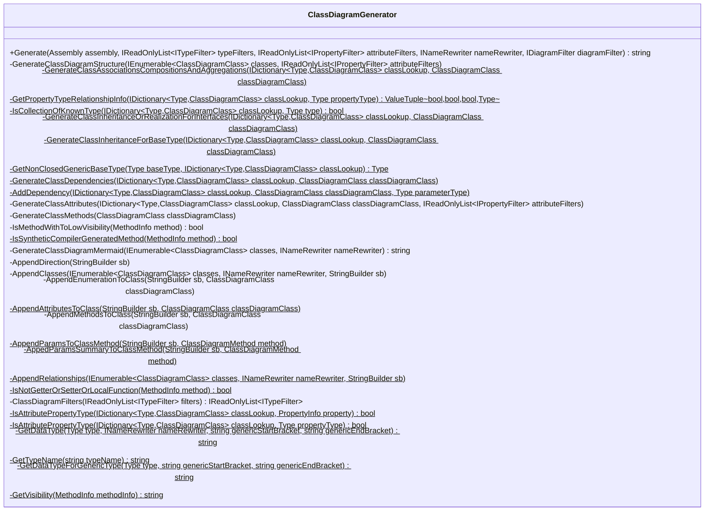
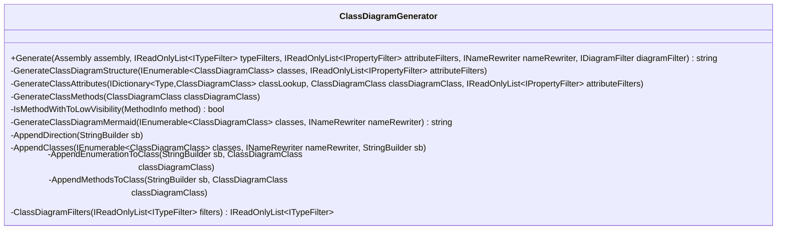
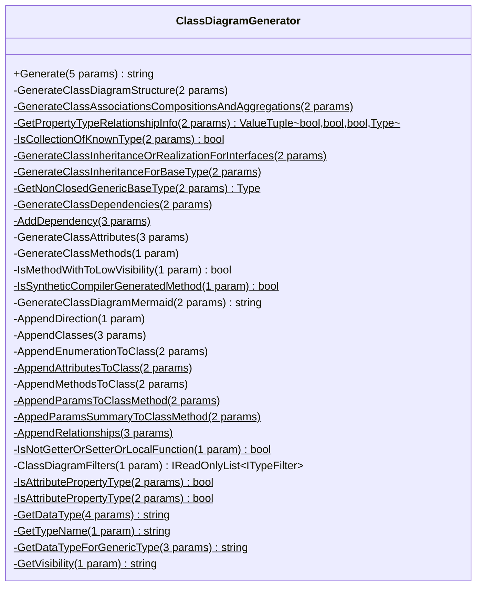
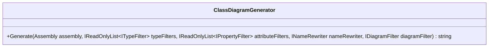
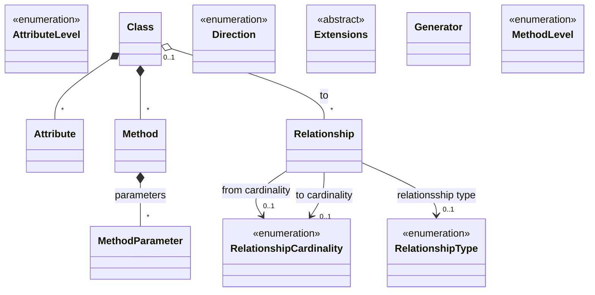

---
# Autogenerated by the Docs build step. Do not edit this file by hand, as your edits will be overwritten by the next Docs build.
# Source file: "docs/_templates/examples/Mermaid-Class-diagram-details.md"
layout: page
title: Examples of how to control the Mermaid Class diagram detail level
description: Examples of how to control the Mermaid Class diagram detail level
show_sidebar: false
toc: true
hero_height: is-fullwidth
---
### About these examples
TODO...

### Example one: No filtering
Most C# codebases will soon contain a lot of types, so a class diagram without any filters can be far to detailed to be of any practical use.
#### The commandline
`dry-gen mermaid-class-diagram-from-csharp --input-file src/develop/DryGen.Docs/bin/Release/net6.0/DryGen.MermaidFromCSharp.dll --output-file docs/examples/mermaid-class-diagram-details.md --replace-token-in-output-file .!.!.replace-token-for-mermaid-class-diagram-details-example-no-filtering.!.!. --include-typenames ^ClassDiagramGenerator$`
#### The resulting Mermaid diagram

### Example : Exclude static methods
Most C# codebases will soon contain a lot of types, so a class diagram without any filters can be far to detailed to be of any practical use.
#### The commandline
`dry-gen mermaid-class-diagram-from-csharp --input-file src/develop/DryGen.Docs/bin/Release/net6.0/DryGen.MermaidFromCSharp.dll --output-file docs/examples/mermaid-class-diagram-details.md --replace-token-in-output-file .!.!.replace-token-for-mermaid-class-diagram-details-example-exclude-static-methods.!.!. --include-typenames ^ClassDiagramGenerator$ --exclude-static-methods true`
#### The resulting Mermaid diagram

### Example : Exclude method params
Most C# codebases will soon contain a lot of types, so a class diagram without any filters can be far to detailed to be of any practical use.
#### The commandline
`dry-gen mermaid-class-diagram-from-csharp --input-file src/develop/DryGen.Docs/bin/Release/net6.0/DryGen.MermaidFromCSharp.dll --output-file docs/examples/mermaid-class-diagram-details.md --replace-token-in-output-file .!.!.replace-token-for-mermaid-class-diagram-details-example-exclude-method-params.!.!. --include-typenames ^ClassDiagramGenerator$ --exclude-method-params true`
#### The resulting Mermaid diagram

### Example : Method level
Most C# codebases will soon contain a lot of types, so a class diagram without any filters can be far to detailed to be of any practical use.
#### The commandline
`dry-gen mermaid-class-diagram-from-csharp --input-file src/develop/DryGen.Docs/bin/Release/net6.0/DryGen.MermaidFromCSharp.dll --output-file docs/examples/mermaid-class-diagram-details.md --replace-token-in-output-file .!.!.replace-token-for-mermaid-class-diagram-details-example-method-level.!.!. --include-typenames ^ClassDiagramGenerator$ --method-level public`
#### The resulting Mermaid diagram

### Example : Name replacement
Most C# codebases will soon contain a lot of types, so a class diagram without any filters can be far to detailed to be of any practical use.
#### The commandline
`dry-gen mermaid-class-diagram-from-csharp --input-file src/develop/DryGen.Docs/bin/Release/net6.0/DryGen.MermaidFromCSharp.dll --output-file docs/examples/mermaid-class-diagram-details.md --replace-token-in-output-file .!.!.replace-token-for-mermaid-class-diagram-details-example-name-replace.!.!. --name-replace-from ClassDiagram --name-replace-to  --include-typenames ^ClassDiagram.* --attribute-level none --method-level none --direction TB`
#### The resulting Mermaid diagram

