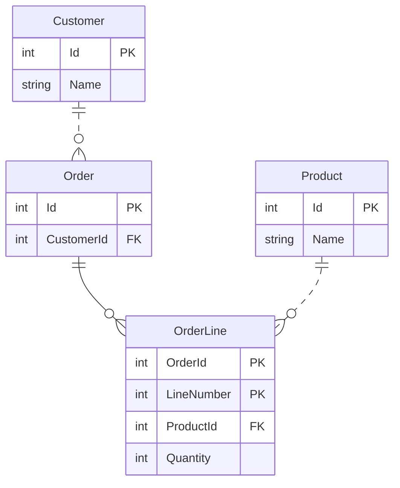

---
# Autogenerated by the Docs build step. Do not edit this file by hand, as your edits will be overwritten by the next Docs build.
# Source file: "docs/_templates/examples/Mermaid-ER-diagram-details.md"
layout: page
title: Examples of how to control the Mermaid diagram detail level
description: Examples of how to control the Mermaid ER diagram detail level
show_sidebar: false
toc: true
hero_height: is-fullwidth
---
### About these examples
TODO...

### Example one: No filtering
Most C# codebases will soon contain a lot of types, so a class diagram without any filters can be far to detailed to be of any practical use.
#### The commandline
`dry-gen mermaid-er-diagram-from-efcore --input-file src/develop/DryGen.Docs/bin/Release/net6.0/DryGen.Docs.dll --output-file docs/examples/mermaid-er-diagram-details.md --replace-token-in-output-file .!.!.replace-token-for-mermaid-er-diagram-details-example-no-filtering.!.!.`
#### The resulting Mermaid diagram

