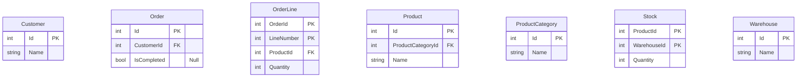

---
# Autogenerated by the Docs build step. Do not edit this file by hand, as your edits will be overwritten by the next Docs build.
# Source file: "docs/_templates/examples/Mermaid-ER-diagram-details.md"
layout: page
title: Examples of how to control the Mermaid ER diagram detail level
description: Examples of how to control the Mermaid ER diagram detail level
show_sidebar: false
toc: true
menubar: examples_menu
hero_height: is-fullwidth
---
These examples shows how you can control the property and method information from your C# types that's included in your Mermaid Class diagrams. Here we use an oversimplified model of an ordering system, and are generated from this C# code: 
<details>
```csharp
using Microsoft.EntityFrameworkCore;
using System.Collections.Generic;


namespace DryGen.Docs.ErDiagramExample;


public class Customer
{
    public int Id { get; set; }
    public string Name { get; set; }
    public ICollection<Order> Orders { get; set; }
}

public class Order
{
    public int Id { get; set; }
    public int CustomerId { get; set; }
    public bool? IsCompleted { get; set; }
    public Customer Customer { get; set; }
    public ICollection<OrderLine> Lines { get; set; }
}

public class OrderLine
{
    public int LineNumber { get; set; }
    public int Quantity { get; set; }
    public int OrderId { get; set; }
    public Order Order { get; set; }
    public int ProductId { get; set; }
    public Product Product { get; set; }
}

public class Product
{
    public int Id { get; set; }
    public string Name { get; set; }
    public int ProductCategoryId { get; set; }
    public ProductCategory ProductCategory { get; set; }
    public ICollection<Stock> InStock { get; set; }
}

public class ProductCategory
{
    public int Id { get; set; }
    public string Name { get; set; }
    public ICollection<Product> Products { get; set; }
}

public class Warehouse
{
    public int Id { get; set; }
    public string Name { get; set; }
    public ICollection<Stock> ProductsInStock { get; set; }
}

public class Stock
{
    public int ProductId { get; set; }
    public Product Product { get; set; }
    public int WarehouseId { get; set; }
    public Warehouse Warehouse { get; set; }
    public int Quantity { get; set; }
}

public class ExampleDbContext : DbContext
{
    public DbSet<Customer> Customers { get; set; }
    public DbSet<Order> Orders { get; set; }
    public DbSet<Product> Products { get; set; }
    public DbSet<ProductCategory> ProductCategories { get; set; }
    public DbSet<Warehouse> Warehouses { get; set; }
    public ExampleDbContext(DbContextOptions options) : base(options) { }
    protected override void OnModelCreating(ModelBuilder modelBuilder)
    {
        modelBuilder.Entity<Customer>().HasKey(x => x.Id);
        modelBuilder.Entity<Order>().HasKey(x => x.Id);
        modelBuilder.Entity<OrderLine>().HasKey(x => new { x.OrderId, x.LineNumber });
        modelBuilder.Entity<Product>().HasKey(x => x.Id);
        modelBuilder.Entity<ProductCategory>().HasKey(x => x.Id);
        modelBuilder.Entity<Warehouse>().HasKey(x => x.Id);
        modelBuilder.Entity<Stock>().HasKey(x => new { x.ProductId, x.WarehouseId });
    }
}

```
</details> 
&nbsp;
 

### Example one: No filtering
With no filtering there's a one-to-one mapping from the structure of your C# types to the entities in the Mermaid ER diagram.
#### The commandline
`dry-gen mermaid-er-diagram-from-efcore --input-file src/develop/DryGen.Docs/bin/Release/net6.0/DryGen.Docs.dll --output-file docs/examples/mermaid-er-diagram-details.md --replace-token-in-output-file .!.!.replace-token-for-mermaid-er-diagram-details-example-no-filtering.!.!.`
#### The resulting Mermaid diagram

### Example two: Control what attributes are displayed with `--attribute-type-exclusion`
In this example we have excluded the foreing key attributes, useful in diagrams where the relationships gives enough details anyway.
#### The commandline
`dry-gen mermaid-er-diagram-from-efcore --input-file src/develop/DryGen.Docs/bin/Release/net6.0/DryGen.Docs.dll --output-file docs/examples/mermaid-er-diagram-details.md --replace-token-in-output-file .!.!.replace-token-for-mermaid-er-diagram-details-example-attribute-type-exclusion.!.!. --attribute-type-exclusion foreignkeys`
#### The resulting Mermaid diagram

### Example three: Control what relationships are displayed with `--relationship-type-exclusion`
If you want a ER diagram that's more like an entity listing, you can exclude all relationships.
#### The commandline
`dry-gen mermaid-er-diagram-from-efcore --input-file src/develop/DryGen.Docs/bin/Release/net6.0/DryGen.Docs.dll --output-file docs/examples/mermaid-er-diagram-details.md --replace-token-in-output-file .!.!.replace-token-for-mermaid-er-diagram-details-example-relationship-type-exclusion.!.!. --relationship-type-exclusion all`
#### The resulting Mermaid diagram

### Example four: Hide attribute key type column with `--exclude-attribute-keytypes`
You can hide the attribute's key type (primary key and/or foreign key) information in situations where is not an important aspect of your diagram.
#### The commandline
`dry-gen mermaid-er-diagram-from-efcore --input-file src/develop/DryGen.Docs/bin/Release/net6.0/DryGen.Docs.dll --output-file docs/examples/mermaid-er-diagram-details.md --replace-token-in-output-file .!.!.replace-token-for-mermaid-er-diagram-details-example-exclude-attribute-keytypes.!.!. --exclude-attribute-keytypes true`
#### The resulting Mermaid diagram

### Example five: Hide attribute comments column with `--exclude-attribute-comments`
You can hide the attribute's comments in situations where is not an important aspect of your diagram.
#### The commandline
`dry-gen mermaid-er-diagram-from-efcore --input-file src/develop/DryGen.Docs/bin/Release/net6.0/DryGen.Docs.dll --output-file docs/examples/mermaid-er-diagram-details.md --replace-token-in-output-file .!.!.replace-token-for-mermaid-er-diagram-details-example-exclude-attribute-comments.!.!. --exclude-attribute-comments true`
#### The resulting Mermaid diagram

### Example six: Filter out attributes with `--exclude-propertynames`
If your C# code follows a convention where all entities have some pure technical properties, e.g. CreatedBy, CreatedAt, ModifiedBy and ModifiedAt, your diagram might be more focused if these properties are excluded. The same might be true if you uses synthetic generated identifiers in your entities.

In this example we show how we can excluded syntetic generated identifiers from our model, both primary keys and forign keys, with `--exclude-propertynames .*Id$`
#### The commandline
`dry-gen mermaid-er-diagram-from-efcore --input-file src/develop/DryGen.Docs/bin/Release/net6.0/DryGen.Docs.dll --output-file docs/examples/mermaid-er-diagram-details.md --replace-token-in-output-file .!.!.replace-token-for-mermaid-er-diagram-details-example-exclude-propertynames.!.!. --exclude-propertynames .*Id$`
#### The resulting Mermaid diagram

